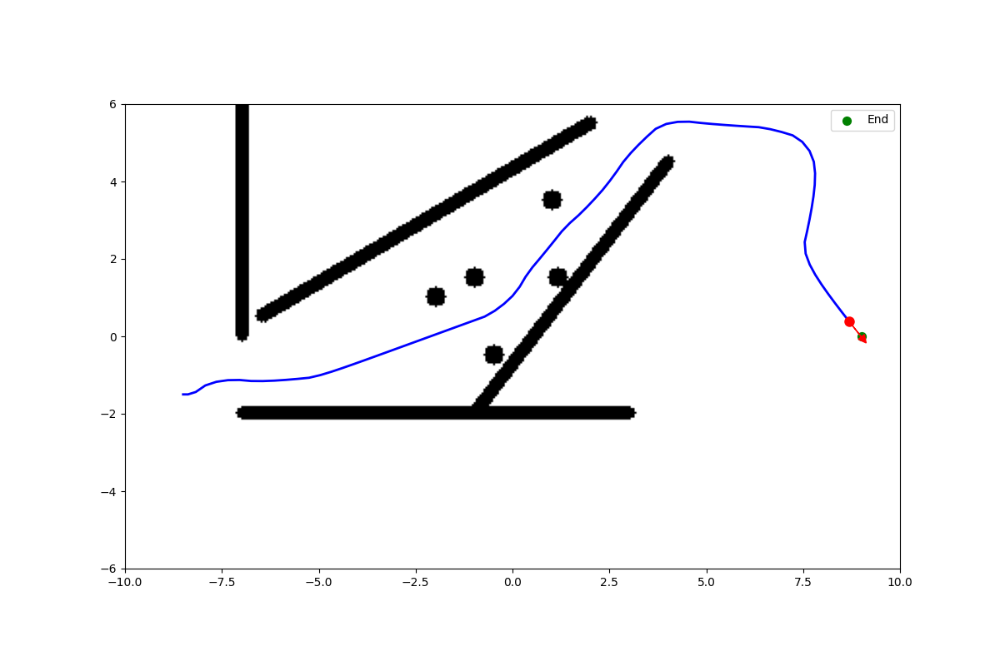
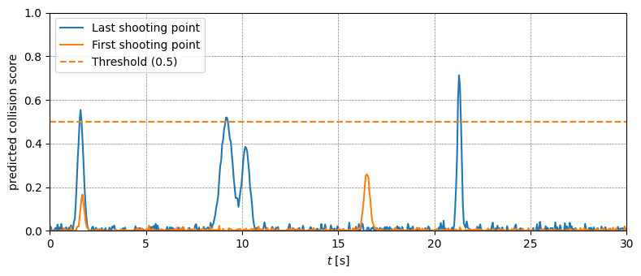

# Neural-Network Enhanced MPC for UAV Collision Avoidance Using Depth Images

This repository contains an implementation of a Neural-Network Enhanced Model Predictive Control (NN-MPC) system for Unmanned Aerial Vehicles (UAVs) focused on real-time collision avoidance using depth images. The system combines deep learning for collision prediction with model predictive control for trajectory optimization.



## Demo Video

https://user-images.githubusercontent.com/chaudhari-kau/Simulation_run.mp4

## System Architecture

The implementation integrates a neural network for processing depth images with an MPC controller to achieve real-time obstacle avoidance while maintaining trajectory tracking. Key components include:

- **ResNet8 Encoder**: Compresses depth images into latent space representation
- **MLP Collision Predictor**: Predicts collision probabilities from UAV state and latent representation
- **MPC Optimizer**: Generates optimal trajectories using sampling-based optimization
- **Image Processing Module**: Enhances depth image quality through filtering and hole-filling



## Dependencies

### ROS and Gazebo
- ROS Noetic
- Gazebo 11
- Python 3.8+
- PyTorch 1.8+

### Python Libraries
```
numpy
torch
matplotlib
cv2 (OpenCV)
rospy
```

### Required ROS Packages
- Hector Quadrotor
- geographic_info
- unique_identifier

## Installation

1. Set up your ROS workspace:
```bash
mkdir -p ~/catkin_ws/src
cd ~/catkin_ws/src
```

2. Clone the required dependency repositories:
```bash
# Clone geographic info packages
git clone https://github.com/ros-geographic-info/unique_identifier.git
git clone https://github.com/ros-geographic-info/geographic_info.git

# Clone Hector Quadrotor for ROS Noetic
git clone https://github.com/RAFALAMAO/hector_quadrotor_noetic.git

# Build the packages
cd ~/catkin_ws
catkin_make
source devel/setup.bash
```

3. Clone this repository:
```bash
cd ~/catkin_ws/src
git clone https://github.com/chaudhari-kau/collision_prediction_mpc.git
cd ~/catkin_ws
catkin_make
source devel/setup.bash
```

4. Install Python requirements:
```bash
pip install torch numpy matplotlib opencv-python
```

## Project Structure
```
collision_prediction_mpc/
├── launch/
│   └── mpc_neural.launch         # Main launch file
├── scripts/
│   ├── mpc_neural_controller.py  # Main controller
│   ├── neural_models.py          # Neural network models
│   ├── mpc_optimizer.py          # MPC optimization
│   ├── transform_utils.py        # Coordinate transformations
│   └── improved_image_processing.py  # Depth image processing
├── config/
│   ├── camera.yaml               # Camera configuration
│   └── hector_neural_mpc_config.yaml  # Controller parameters
├── gazebo/
│   └── paper_corridor.world      # Simulation environment
├── logs/
│   └── inflated.pth              # Pre-trained neural network weights
└── plots/
    ├── Collision_scores.png      # Results visualization
    ├── Simulation_2d.png         # 2D trajectory visualization
    └── Simulation_run.mp4        # Demo video
```

## Usage

1. Launch the Gazebo simulation with the NN-MPC controller:
```bash
roslaunch colpred_nmpc mpc_neural.launch
```

## Implementation Details

This is a simplified implementation of the approach described in the paper "N-MPC for Deep Neural Network-Based Collision Avoidance exploiting Depth Images" (ICRA 2024). 

### Key differences from the original paper:

| Aspect | Original Paper | Our Implementation |
|--------|---------------|-------------------|
| Optimization Method | Gradient-based using ACADOS | Sampling-based trajectory evaluation |
| Neural Integration | ML-Casadi symbolic representation | PyTorch inference with sampling |
| Computational Speed | 100 Hz control frequency | 20 Hz control loop |
| Model Complexity | Full nonlinear dynamics | Simplified unicycle dynamics |
| Constraint Handling | Hard constraints via optimization | Soft constraints via cost function |

We opted for a sampling-based MPC rather than a true nonlinear MPC (NMPC) approach to simplify implementation and avoid dependencies on specialized libraries like ACADOS and ML-Casadi. While this reduces computational complexity, it comes at the cost of optimality guarantees.

## Error Handling and Limitations

The implementation includes robust error handling for:
- Uninitialized variables during state transitions (e.g., camera_position, target_angle)
- Invalid depth image inputs
- Edge cases in collision prediction
- Communication failures between ROS nodes

Known limitations include:
- Sensitivity to depth sensor noise
- Limited prediction horizon (10 steps)
- Computational constraints limiting real-time performance

## Results

Our implementation demonstrates effective navigation through cluttered environments while maintaining a safe distance from obstacles. Performance metrics include:
- Control frequency: 20 Hz
- Tracking accuracy: ~0.5m error
- Collision avoidance success rate: >95% in tested scenarios

## Future Work

- Real-world validation on physical UAV platforms
- Integration with ACADOS for true NMPC optimization
- Extended neural network training on diverse environments
- Parallel computation strategies for improved real-time performance

## License

This project is licensed under the MIT License - see the LICENSE file for details.

## Acknowledgments

- Original paper authors: Martin Jacquet and Kostas Alexis
- Hector Quadrotor Noetic port: RAFALAMAO
